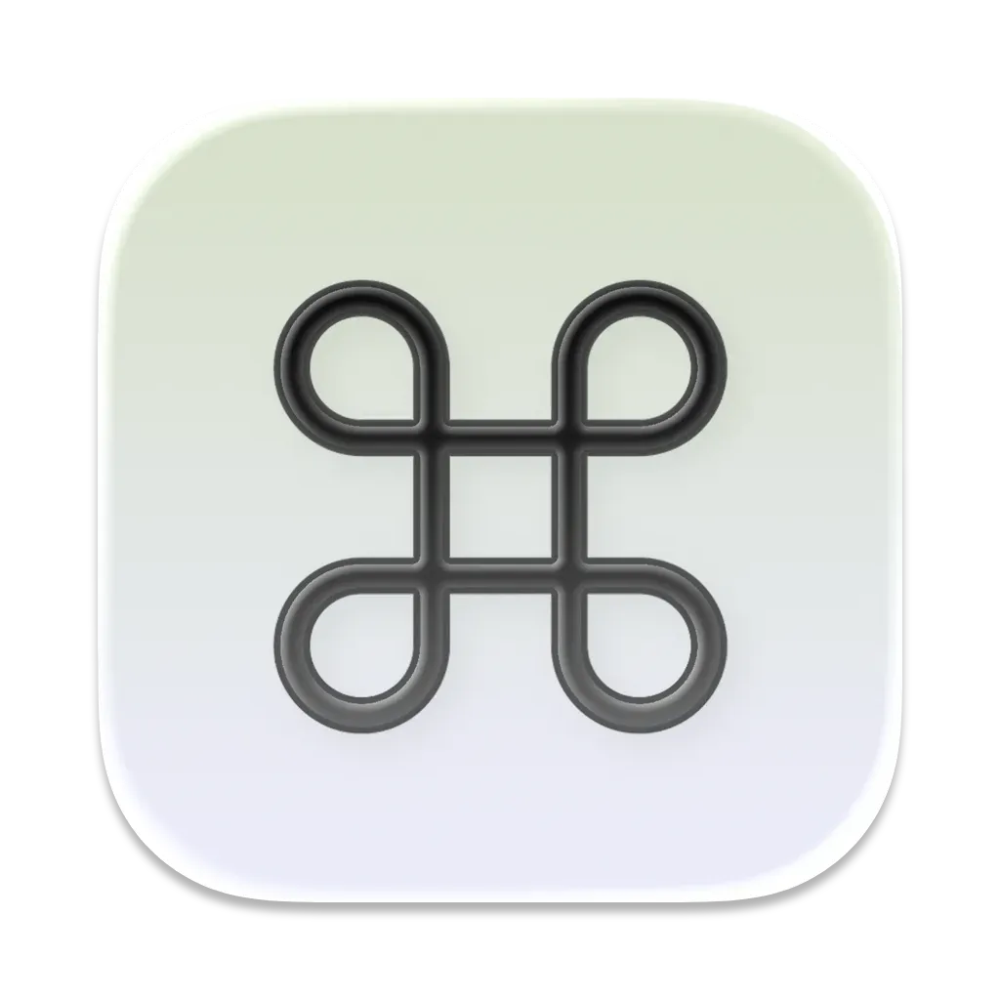

<div align="center">
  

  <h1>cmdX</h1>

  <p><strong>The missing Cmd + X for macOS Finder.</strong></p>

  <p>
    
    
    
    
  </p>
  <p>
    <a href="https://github.com/YONN2222/cmdX"></a>
    <a href="https://github.com/YONN2222/cmdX/releases"></a>
    <a href="https://github.com/YONN2222/cmdX/issues"></a>
    <a href="https://github.com/YONN2222/cmdX/pulls"></a>
  </p>
</div>

<br />

> cmdX is a small, open-source macOS utility that brings Cmd + X / Cmd + V file cutting to Finder, just like on Windows or Linux. No account, no telemetry, no background bloat.

## 1. Overview

macOS Finder never got a real Cut shortcut. You can copy a file with ⌘C and paste it as a move with ⌘⌥V, but that two-step trick is easy to miss and doesn't match how every other operating system handles cut & paste. cmdX makes ⌘X and ⌘V work the same way in Finder as they do everywhere else.

cmdX lives in the menu bar, listens only for shortcuts while Finder is frontmost, and does nothing else. No data collection, no accounts.

## 2. Features

- **Cmd + X / Cmd + V for files**: cut in Finder, paste to move, exactly like you'd expect from any other app.
- **Native integration**: works directly inside Finder, no extra windows or extensions to manage.
- **Lightweight**: runs quietly in the menu bar without slowing down your Mac.
- **Private by design**: no tracking, no analytics, no data collection. Your files never leave your Mac.
- **Universal binary**: native performance on both Apple Silicon and Intel Macs.

## 3. Installation

**From GitHub Releases**

Grab the latest build directly from the releases page:

> https://github.com/YONN2222/cmdX/releases

**Via Homebrew**

Thanks to [thedavidwenk](https://github.com/thedavidwenk), you can also install cmdX through Homebrew:

```sh
brew tap thedavidwenk/cmdx
brew install cmdx
```

Repository:
> https://github.com/thedavidwenk/homebrew-cmdx

## 4. Usage

1. Open Finder
2. Select a file
3. Press **Cmd + X** to cut
4. Navigate to the destination folder
5. Press **Cmd + V** to paste (move)

## 5. Build It Yourself

1. **Clone the repository**
   ```bash
   git clone https://github.com/YONN2222/cmdX.git
   cd cmdX
   ```

2. **Open the project in Xcode**
   ```bash
   open cmdX.xcodeproj
   ```

3. **Build the app**
   ```bash
   xcodebuild -scheme cmdX -configuration Release
   ```

<details>
<summary><h2 style="display:inline;">6. Technical details</h2></summary>

### Tech Stack

| Component | Stack                                                           |
|-----------|-----------------------------------------------------------------|
| App       | Swift + AppKit/SwiftUI, targeting macOS 14+                     |
| Shortcuts | `CGEventTap` on the Finder process, no global hooks elsewhere   |
| Menu bar  | SwiftUI `MenuBarExtra`, no Dock icon (`LSUIElement`)            |

### Repository Structure

```text
cmdX/
├── cmdX/
│   ├── cmdXApp.swift        # App entry point, menu bar scene
│   ├── ContentView.swift    # Settings popover UI
│   ├── KeyInterceptor.swift # Cmd+X / Cmd+V event tap for Finder
│   ├── UpdateChecker.swift  # GitHub Releases update check
│   └── WindowAccessor.swift
├── website/                 # cmdx website (static HTML/CSS/JS, no external requests)
└── assets/                  # Images used in this README
```

</details>

### Note

You need to grant **Accessibility permissions** to cmdX under **System Settings → Privacy & Security → Accessibility**.

## About

cmdX is written by [YONN2222](https://github.com/YONN2222) as a free, open-source passion project.

---

<div align="center">
  <sub>Licensed under <a href="LICENSE">MIT</a>.</sub>
</div>
